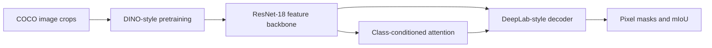

# Self-Supervised Features for Class-Conditioned Segmentation

This project studies whether self-supervised visual representations can improve semantic segmentation. It trains a ResNet-18 backbone with DINO-style multi-crop learning, reuses the learned features in a DeepLab-style decoder, and adds class-conditioned attention for single-class segmentation.

The experiments use a five-class COCO subset:

| Class IDs | Categories |
| --- | --- |
| 1, 2, 3, 17, 18 | person, bicycle, car, cat, dog |

## Results at a glance

| Experiment | Result |
| --- | ---: |
| DINO-style pretraining | 10 epochs; qualitative nearest-neighbor and t-SNE analysis completed |
| Attention segmentation with assignment weights | Best reported mIoU: **0.2010** |
| Attention segmentation with DINO-pretrained weights | Best reported mIoU: **0.24** |

The values above are taken from the accompanying [project report](docs/cv_report.pdf). Training curves and qualitative outputs are available in [`pretraining_dino/`](pretraining_dino/), [`attention_binary_img/`](attention_binary_img/), and [`nn_imgs/`](nn_imgs/). See [docs/RESULTS.md](docs/RESULTS.md) for experiment details and interpretation.

## Pipeline



1. **Representation learning:** [`pretrain.py`](pretrain.py) trains teacher and student ResNet-18 networks with global and local crops, cosine schedules, EMA teacher updates, and a DINO loss.
2. **Multiclass segmentation:** [`dt_multiclass_ss.py`](dt_multiclass_ss.py) predicts background plus the five selected semantic categories.
3. **Attention segmentation:** [`dt_single_ss.py`](dt_single_ss.py) embeds a requested class vector, applies scaled dot-product attention to encoder features, and predicts a binary mask for that class.
4. **Qualitative retrieval:** [`nearest_neighbors.py`](nearest_neighbors.py) compares image embeddings using nearest-neighbor search.

## Repository guide

| Path | Purpose |
| --- | --- |
| [`pretrain.py`](pretrain.py) | DINO-style self-supervised pretraining, validation loss, and t-SNE export |
| [`dt_multiclass_ss.py`](dt_multiclass_ss.py) | Five-class semantic segmentation training and validation |
| [`dt_single_ss.py`](dt_single_ss.py) | Class-conditioned attention segmentation |
| [`nearest_neighbors.py`](nearest_neighbors.py) | Feature-space nearest-neighbor analysis |
| [`data/`](data/) | Dataset readers, annotation parsing, augmentations, and transforms |
| [`models/`](models/) | ResNet-18 backbone, DINO head, attention, decoder, and segmentators |
| [`utils/`](utils/) | Metrics, logging, schedulers, checkpoint loading, and meters |
| [`pretraining_dino/`](pretraining_dino/) | DINO training and validation loss plots |
| [`attention_binary_img/`](attention_binary_img/) | Attention segmentation loss and mIoU plots |
| [`nn_imgs/`](nn_imgs/) | Saved nearest-neighbor examples |
| [`cv_report.pdf`](cv_report.pdf) | Original experiment report |
| [`run_commands`](run_commands) | Historical command example |

## Data layout

The scripts expect a prepared dataset rather than downloading COCO automatically. The segmentation scripts use this layout:

```text
<data_folder>/
├── imgs/
│   ├── train2014/
│   └── val2014/
├── aggregated_annotations_train_5classes.json
└── aggregated_annotations_val_5classes.json
```

The pretraining and nearest-neighbor scripts expect image crops with `train/` and `val/` subdirectories. Dataset parsing and mask construction live in [`data/segmentation.py`](data/segmentation.py) and [`data/pretraining.py`](data/pretraining.py).

## Running the experiments

Create an environment with a CUDA-enabled PyTorch installation compatible with the local GPU, then install the Python dependencies listed above. From the repository root:

```bash
# Self-supervised pretraining
python pretrain.py --data_folder /path/to/crops/images/256 --output-root results

# Five-class semantic segmentation
python dt_multiclass_ss.py \
    --data_folder /path/to/COCO_mini5class_medium \
    --pretrained_model_path /path/to/checkpoint.pth \
    --output-root results

# Class-conditioned attention segmentation
python dt_single_ss.py \
    --data_folder /path/to/COCO_mini5class_medium \
    --pretrained_model_path /path/to/checkpoint.pth \
    --output-root results

# Nearest-neighbor analysis
python nearest_neighbors.py \
    --data_folder /path/to/crops/images/256 \
    --weights-init /path/to/pretraining/checkpoint.pth \
    --output-root results
```

Outputs are written below `results/`, including checkpoints, TensorBoard logs, loss/mIoU summaries, and t-SNE figures. The source files currently contain historical absolute-path defaults from the original training environment; pass explicit paths as shown above when running elsewhere.

## TensorBoard

```bash
tensorboard --logdir results
```

The training scripts log losses, mIoU, experiment parameters, sample images, predictions, and attention maps. Checkpoint files contain model and optimizer state together with validation loss and mIoU.

## Reproducibility notes

- Experiments were run on CUDA hardware and the scripts call `.cuda()` directly.
- Random seeds are fixed in the segmentation entry points, but exact results can still vary with PyTorch, torchvision, CUDA, and GPU versions.
- The repository stores plots, logs, and qualitative examples, but not the source dataset or large model checkpoints.
- The historical scripts were written for an older PyTorch ecosystem; modern installations may require dependency-version adjustments.

