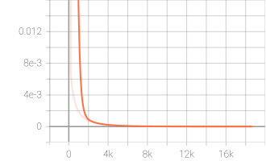
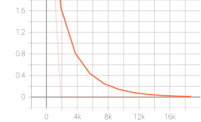

# Experiment Results

This page records the results that are available in the repository and the accompanying report. It intentionally separates measured values from qualitative observations so that undocumented runs are not presented as benchmarks.

## Summary

| Stage | Configuration | Reported outcome | Evidence |
| --- | --- | --- | --- |
| Self-supervised pretraining | ResNet-18 teacher/student, DINO-style multi-crop training, 10 epochs | Learned feature space became more separated in the epoch-9 t-SNE visualization, nearest neighbors showed visually meaningful similarities | [`pretrain.py`](../pretrain.py), [`pretraining_dino/`](../pretraining_dino/), [`nn_imgs/`](../nn_imgs/), [report](cv_report.pdf) |
| Multiclass segmentation | ResNet-18 features with DeepLab-style decoder, background plus five categories | One tracked log records validation mIoU 0.1461 at epoch 1, no final benchmark is claimed here | [`dt_multiclass_ss.py`](../dt_multiclass_ss.py), [`dt_multi_log`](../dt_multi_log) |
| Attention segmentation | Class embedding plus scaled dot-product attention; assignment initialization | Best reported mIoU: **0.2010** | [`dt_single_ss.py`](../dt_single_ss.py), [`attention_pretrained_binary_log`](../attention_pretrained_binary_log), [report](cv_report.pdf) |
| Attention segmentation | Same architecture initialized from DINO weights | Best reported mIoU: **0.24** | [`dt_single_ss.py`](../dt_single_ss.py), [`attention_binary_img/`](../attention_binary_img/), [report](cv_report.pdf) |

## Self-supervised pretraining

[`pretrain.py`](../pretrain.py) builds a ResNet-18 student and teacher. Each training example produces two global views and four local views. The student processes all views, the teacher processes the global views, and the teacher is updated with an exponential moving average. Learning rate, weight decay, and teacher momentum use cosine schedules.

The validation path logs the DINO loss and exports t-SNE projections of backbone features. The stored plots are:

The report describes the epoch-9 embedding as more spread out than the epoch-0 embedding. [`nearest_neighbors.py`](../nearest_neighbors.py) provides the complementary qualitative test by retrieving nearby images in feature space. Example outputs are stored in [`nn_imgs/`](../nn_imgs/).

## Segmentation experiments

Both segmentation entry points use a ResNet-18 encoder and the ASPP-based decoder in [`models/deeplab_decoder.py`](../models/deeplab_decoder.py). The data readers construct masks from aggregated COCO polygon annotations in [`data/segmentation.py`](../data/segmentation.py), and the selected categories are declared near the top of that file.

### Attention model

[`models/att_segmentation.py`](../models/att_segmentation.py) maps a class one-hot vector into the encoder feature dimension, applies the attention implementation in [`models/attention_layer.py`](../models/attention_layer.py), and decodes the attended feature map into a binary mask. The training script also logs attention maps alongside images, targets, and predictions.

The tracked plots show the training and validation behavior for the attention experiment:

The report compares two initializations:

- Assignment-provided weights: best mIoU **0.2010**.
- DINO-pretrained weights: best mIoU **0.24**.

The reported comparison suggests that the self-supervised initialization improved the attention segmentation result by approximately 0.039 mIoU, or 19.4% relative to 0.2010. This comparison should be interpreted as the result of the recorded experiments, not as a controlled statistical study: the repository does not include repeated-run variance or a complete standardized evaluation script.

## How metrics are computed

- Multiclass segmentation uses [`instance_mIoU`](../utils/__init__.py), which averages IoU over non-background predicted classes that have a non-empty union.
- Attention segmentation uses [`mIoU`](../utils/__init__.py), which evaluates the foreground mask for the binary output.
- Training and validation metrics are written to TensorBoard and printed to the experiment logs.

## Limitations and reproducibility

- The dataset is not included in this repository; the scripts require the prepared COCO subset and crop directories.
- Model checkpoints are not tracked, so the exact reported initialization files must be supplied separately.
- The code assumes a CUDA device and contains historical absolute-path defaults.
- The available report gives headline attention mIoU values, but not per-class IoU, confidence intervals, or a complete table for every tracked run.
- The multiclass value listed above is a directly observed intermediate validation result from a tracked log, not a claimed final score.
